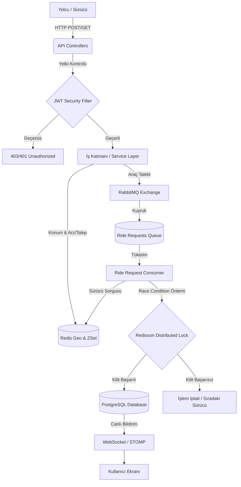

# 🚖 SurgeRide API - Real-Time Ride-Hailing Backend Architecture

> Uber ve Getir gibi modern sistemlerin arka planında çalışan anlık konum takibi, asenkron eşleştirme ve dinamik fiyatlandırma (Surge Pricing) mimarisinin Spring Boot ile geliştirilmiş, yüksek ölçeklenebilir (scalable) backend servisidir.

      

## 🏗️ Sistem Mimarisi (Architecture)

Sistem, geleneksel senkron REST mimarisi yerine mesaj kuyrukları (Message Brokers) ve bellek içi (In-Memory) veri yapıları kullanılarak darboğazları (bottleneck) önleyecek şekilde tasarlanmıştır.



## 🚀 Öne Çıkan Mühendislik Çözümleri

* **Dinamik Fiyatlandırma (Surge Pricing):** Redis `ZSet` ve `GeoHash` algoritmaları kullanılarak, belirli bir bölgedeki son 5 dakikalık arz (aktif sürücü) ve talep (araç arayan yolcu) oranları milisaniyeler içinde hesaplanır. Talep yoğunluğuna göre fiyat çarpanı otomatik güncellenir.
* **Asenkron Eşleştirme Motoru:** Kullanıcı araç çağırdığında API kilitlenmez (Non-blocking). İstek, **RabbitMQ** kuyruğuna aktarılır. Arka plandaki `RideRequestConsumer`, en yakın sürücüyü bulur ve eşleştirmeyi yapar.
* **Dağıtık Kilit (Distributed Lock) Yönetimi:** Aynı anda iki farklı yolcunun tek bir boş sürücüyle eşleşmesi (Race Condition) riskine karşı **Redisson** kullanılarak sürücü kilitlenir. Eşleşme sadece ilk kilit alan yolcuya atanır.
* **Anlık Konum ve Hızlı Sorgu:** Sürücü konumları geleneksel RDBMS veritabanları yerine, coğrafi veriler için optimize edilmiş **Redis GeoSpatial** veri yapısında saklanır.
* **Stateless Güvenlik Mimarisi:** Sistem oturum (Session) tutmaz. Tüm güvenlik **Spring Security** ve özel yazılmış `JwtFilter` üzerinden **JWT (JSON Web Token)** ile sağlanır.

## 🛠️ Kullanılan Teknolojiler (Tech Stack)

* **Backend Mimarisi:** Java 17, Spring Boot 3.2.6, Hibernate (JPA)
* **Güvenlik:** Spring Security, JWT (jjwt)
* **Message Broker:** RabbitMQ
* **Önbellek & Dağıtık Yapılar:** Redis, Redisson (Distributed Lock), GeoHash
* **Veritabanı:** PostgreSQL
* **Canlı İletişim:** WebSockets (STOMP)
* **Monitoring & Metrik:** Prometheus, Grafana, Spring Boot Actuator
* **API Dokümantasyonu:** OpenAPI (Swagger 3)
* **Altyapı & Dağıtım:** Docker, Docker Compose

## ⚙️ Kurulum ve Ayağa Kaldırma (Quick Start)

Projeyi lokal ortamınızda çalıştırmak için sisteminizde Java 17 ve Docker yüklü olmalıdır.

**1. Altyapı Servislerini Başlatın (PostgreSQL, Redis, RabbitMQ, Prometheus, Grafana):**
```bash
docker-compose up -d
```

**2. Projeyi Derleyin ve Çalıştırın:**
```bash
./mvnw clean install
./mvnw spring-boot:run
```

**3. API Dokümantasyonuna Erişin:**
Proje `8080` portunda ayağa kalktıktan sonra tüm uç noktaları test etmek için tarayıcınızdan Swagger arayüzüne gidin:
`http://localhost:8080/swagger-ui/index.html`

## 🔒 Test ve Kullanım Senaryosu (User Flow)

Sistemi Swagger üzerinden test ederken aşağıdaki adımları sırasıyla izleyin:

1. **Kayıt Olun:** `POST /api/auth/register` ucunu kullanarak sisteme `RIDER` veya `DRIVER` rolüyle yeni bir kullanıcı kaydedin.
2. **Giriş Yapın:** `POST /api/auth/login` ucuna bilgilerinizi göndererek sistemden size özel üretilmiş **JWT Token**'ı alın.
3. **Yetkilendirme:** Swagger sayfasının sağ üst köşesindeki **"Authorize"** butonuna tıklayın ve aldığınız token'ı `Bearer <sizin_tokeniniz>` formatında yapıştırın. (Artık sistemdeki yetki gerektiren tüm uç noktalara erişebilirsiniz).
4. **Sürücü Konumu Gönderin:** `POST /api/locations/driver` ile bir sürücüyü haritada aktif hale getirin.
5. **Araç Çağırın:** `POST /api/rides/request` ile yolcu olarak bir araç çağırın. Sistem RabbitMQ üzerinden isteğinizi işleyecek ve WebSocket üzerinden bildirim gönderecektir.

## 🧪 Yük Testi (Chaos Testing)

Proje içerisindeki `ChaosTest.java` sınıfı, sistemin asenkron yapısını ve Redis/RabbitMQ direncini ölçmek için tasarlanmıştır. Bu testi çalıştırdığınızda, aynı saniye içerisinde aynı bölgede **500 farklı yolcunun** aynı anda fiyat tahmini ve araç çağırma isteği simüle edilir. Grafana ve loglar üzerinden sistemin darboğaza girmeden talepleri nasıl erittiğini gözlemleyebilirsiniz.
